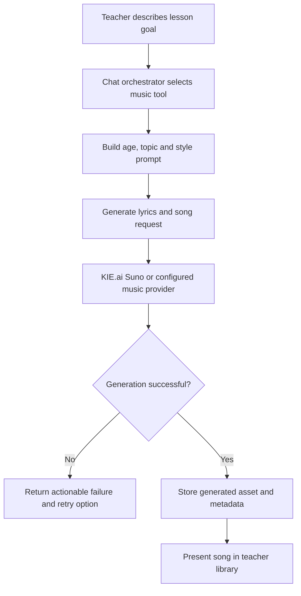

# TeacherHelper — core business flow: song generation

```mermaid
flowchart TD
  A[Teacher describes lesson goal] --> B[Chat orchestrator selects music tool]
  B --> C[Build age, topic and style prompt]
  C --> D[Generate lyrics and song request]
  D --> E[KIE.ai Suno or configured music provider]
  E --> F{Generation successful?}
  F -- No --> G[Return actionable failure and retry option]
  F -- Yes --> H[Store generated asset and metadata]
  H --> I[Present song in teacher library]
```

The orchestrator remains responsible for tool selection; the provider only creates the requested media.
