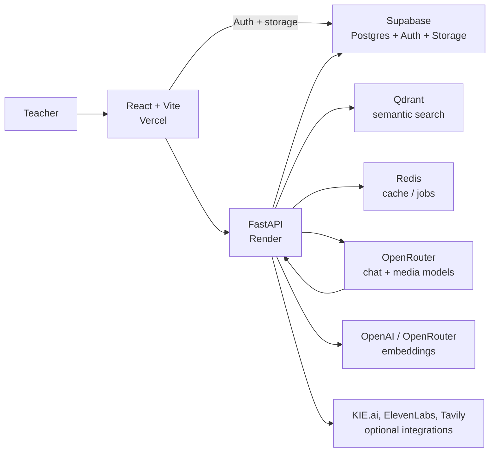

# TeacherHelper — current architecture

```mermaid
flowchart LR
  T[Teacher] --> FE[React + Vite\nVercel]
  FE -->|Auth + storage| SB[Supabase\nPostgres + Auth + Storage]
  FE --> API[FastAPI\nRender]
  API --> SB
  API --> Q[Qdrant\nsemantic search]
  API --> R[Redis\ncache / jobs]
  API --> OR[OpenRouter\nchat + media models]
  API --> OE[OpenAI / OpenRouter\nembeddings]
  API --> EXT[KIE.ai, ElevenLabs, Tavily\noptional integrations]
  OR --> API
```

The chat orchestrator invokes module tools for educational materials; uploaded content is chunked, embedded, and searched through Qdrant.
