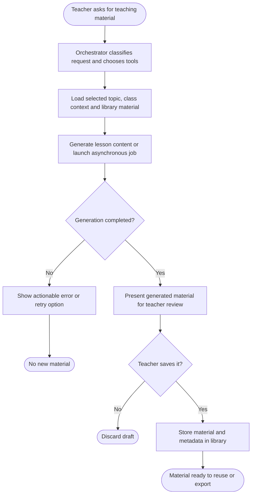

# TeacherHelper — business flow: AI teaching-material generation

```mermaid
flowchart TD
    start([Teacher asks for teaching material]) --> classify[Orchestrator classifies request and chooses tools]
    classify --> context[Load selected topic, class context and library material]
    context --> generate[Generate lesson content or launch asynchronous job]
    generate --> completed{Generation completed?}
    completed -- No --> error[Show actionable error or retry option]
    error --> end1([No new material])
    completed -- Yes --> review[Present generated material for teacher review]
    review --> save{Teacher saves it?}
    save -- No --> end2([Discard draft])
    save -- Yes --> library[Store material and metadata in library]
    library --> end3([Material ready to reuse or export])
```
