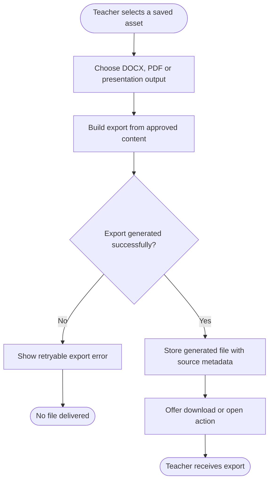

# TeacherHelper — business flow: document export

```mermaid
flowchart TD
    start([Teacher selects a saved asset]) --> format[Choose DOCX, PDF or presentation output]
    format --> build[Build export from approved content]
    build --> valid{Export generated successfully?}
    valid -- No --> error[Show retryable export error]
    error --> end1([No file delivered])
    valid -- Yes --> file[Store generated file with source metadata]
    file --> download[Offer download or open action]
    download --> end2([Teacher receives export])
```
