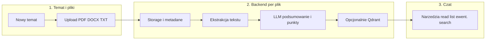

# Omówienie tematu (Topic Studio) — flow w stylu NotebookLM

## Cel

Dać nauczycielowi **jedno miejsce na temat lekcji oparty na materiałach źródłowych**: zebranie **wielu plików** (PDF, Word, TXT), **utrwalenie każdego pliku w aplikacji** wraz z **krótkim podsumowaniem i listą najważniejszych punktów** (generowanymi przez LLM na podstawie wyekstrahowanej treści), opcjonalnie **zapis wektorowy w Qdrant** przy tym samym imporcie, a następnie **konwersację z modelem** w celu omówienia tematu — w granicach limitu kontekstu i reguł produktu.

To jest **osobny nurt** od **Asystenta** (czat z tool callingiem i generowaniem scenariuszy, grafik, itd.). Oba mogą współdzielić storage i metadane plików; **sposób dostarczania treści do LLM** w Omówieniu tematu jest świadomym wyborem architektonicznym (patrz niżej).

---

## Flow biznesowy (wysoki poziom)

1. **Wejście w zakładkę** „Omówienie tematu” (lub równoważna nazwa UX).
2. **Utworzenie nowego tematu** — użytkownik nadaje nazwę (np. „Fotosynteza — klasa 7”). Powstaje rekord tematu powiązany z kontem.
3. **Dodanie plików źródłowych** — w ramach tematu użytkownik dodaje **jeden lub wiele** plików:
   - dozwolone typy: **PDF**, **DOCX/DOC** (Word), **TXT** (ew. rozszerzenia listy później);
   - możliwość **wielu plików naraz** (multi-select / przeciągnij-i-upuść).
4. **Przy każdym wgrywaniu** (dla każdego pliku z osobna, równolegle lub w kolejce):
   - **zapis pliku** w storage aplikacji + metadane powiązane z tematem (`topic_id`, `user_id`);
   - **ekstrakcja tekstu** z pliku i utrwalenie (pełny tekst lub chunki w bazie — według potrzeb odczytu i ewentualnego indeksu);
   - **LLM: krótkie podsumowanie** (kilka zdań) oraz **wypisanie najważniejszych punktów** — zapisane przy rekordzie pliku (np. pola `summary`, `key_points` / lista punktów), widoczne w UI jako „karta” pliku;
   - **opcjonalnie:** **indeks wektorowy w Qdrant** (embeddingi chunków tego samego pliku), aby od razu umożliwić wyszukiwanie semantyczne w ramach tematu — bez rozdzielania tego na „później, jeśli RAG”.
5. **Stan gotowości** — gdy przetwarzanie się zakończyło (lub błędy per plik są widoczne), UI przechodzi do **trybu rozmowy**.
6. **Rozmowa z LLM** — osobne okno czatu nad tematem:
   - model omawia treść **wyłącznie w kontekście plików tego tematu** (podsumowania, pełny tekst przez narzędzia, ewentualnie semantic search jeśli Qdrant jest włączony);
   - historia rozmowy powiązana z tematem (osobna konwersacja lub wątek pod `topic_id`).

---

## Przetwarzanie przy imporcie — wymagania produktowe

| Element | Opis |
|--------|------|
| **Trwały plik** | Każdy upload = osobny zasób w systemie (nie tylko „tymczasowy” bufor przed czatem). |
| **Podsumowanie + punkty** | Obowiązkowo po udanej ekstrakcji tekstu; spójny format (np. 2–5 zdań + lista 3–10 punktów); wersjonowanie przy ponownym przetworzeniu pliku. |
| **Qdrant** | Opcja konfiguracyjna / feature flag: przy imporcie można równolegle **zasilić kolekcję** chunkami z filtrem `topic_id` + `user_id`. |
| **UI** | Lista plików tematu z widocznym podsumowaniem / punktami (zwiń–rozwiń); status: przesyłanie → ekstrakcja → podsumowanie → gotowe. |

---

## Jak model „widzi” dokumenty w czacie: agentyczne narzędzia vs RAG

**Narzędzia (typowe agentic tool calling)** — wzorzec jak „filesystem MCP” (TeacherHelper nie musi być serwerem MCP):

- `list_topic_files` — lista plików w temacie (id, nazwa, ewentualnie skrót z podsumowania);
- `get_file_metadata` — metadane + **podsumowanie i kluczowe punkty** (żeby model mógł odpowiedzieć bez pełnego odczytu, gdy to wystarcza);
- `read_file_content` — treść lub fragment (offset/limit / chunk).

**RAG (Qdrant)** — jeśli włączony przy imporcie:

- dodatkowe narzędzie np. `semantic_search_in_topic` dla pytań „gdzie jest o…?” bez liniowego czytania całości;
- nadal możliwe **hybrydowo**: podsumowania w kontekście systemowym + pełny odczyt lub retrieval wg potrzeby.

**Trade-offy** (bez zmiany intencji produktowej):

| Podejście | Plusy | Minusy |
|-----------|--------|--------|
| **List / read + podsumowania** | Prosty model mentalny; podsumowania tanie w kontekście | Bardzo duże PDF nadal wymagają chunkowania przy odczycie |
| **+ Qdrant przy imporcie** | Od razu skalowalne wyszukiwanie w temacie | Koszt embeddingów i utrzymanie indeksu zsynchronizowanego z plikiem |

---

## Diagram (uproszczony)

---

## Zasady produktowe

| Zasada | Opis |
|--------|------|
| **Izolacja** | Tematy i pliki widoczne tylko dla właściciela (`user_id`). |
| **Jasny stan UI** | „Przesyłanie → Przetwarzanie (ekstrakcja, podsumowanie) → Gotowe do rozmowy”. |
| **Wielopliki** | Wiele plików w jednym temacie; narzędzia i UI uwzględniają wybór pliku. |
| **Typy plików** | Start: PDF, Word, TXT; rozszerzenia (np. PPTX) wg kolejnych iteracji. |
| **Podsumowanie per plik** | Zawsze po imporcie (o ile ekstrakcja się powiodła); użytkownik widzi „o czym jest plik” przed czatem. |
| **Rozdział od Asystenta** | Asystent = generowanie materiałów + tool calling. Omówienie tematu = **omówienie dokumentów źródłowych** (inny zestaw narzędzi / inny system prompt). |

---

## Powiązanie z istniejącym kodem (kierunek implementacji)

- Ponowne użycie: upload, ekstrakcja, chunking, **Qdrant** — pipeline importu może wołać te same serwisy co dziś, powiązane z encją **temat** zamiast tylko „projekt”.
- Do zamodelowania:
  - encja **temat** (`topic`) + **plik tematu** (`topic_source_file` lub rozszerzenie `FileAsset` z `topic_id`);
  - pola **summary**, **key_points** (JSON/lista) przy pliku źródłowym tematu;
  - job kolejki: upload → extract → **summarize** → opcjonalnie **embed + upsert Qdrant**;
  - osobny orchestrator / **ToolDefinition** dla czatu „Omówienie tematu”;
  - limity: długość podsumowania, liczba punktów, max odpowiedź narzędzia `read_*`, audyt odczytów.

---

## Nazewnictwo (UX)

Propozycje dla UI (PL):

- Zakładka: **„Omówienie tematu”** lub **„Źródła i rozmowa”**.
- Akcja: **„Nowy temat”**.
- Stan: **„Przetwarzanie…”** / **„Możesz omówić temat”**.

---

*Dokument roboczy — spójny z [ZASADY_I_WYMAGANIA.md](../ZASADY_I_WYMAGANIA.md).*
